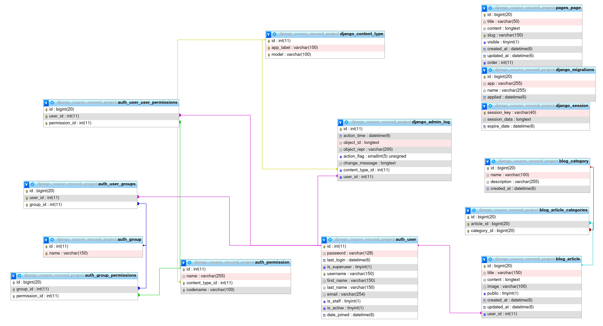
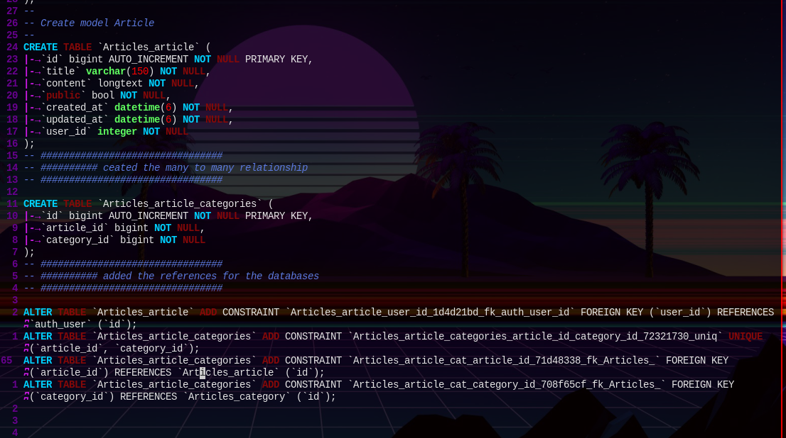

# This is the structure explanation for the class bases de datos avanzadas
This project when finished is going to have 4 parts
- the downloads part
- the article part
- the user and permissions part
- the forum part (questions and answers)

# being extra is going to have a part for statistics and graphs. so that the main user can see their own statistics and the web page statistics

# here is the explanation for for the databases contections
# check the pdf django_course_second_project.pdf for a better explanation

